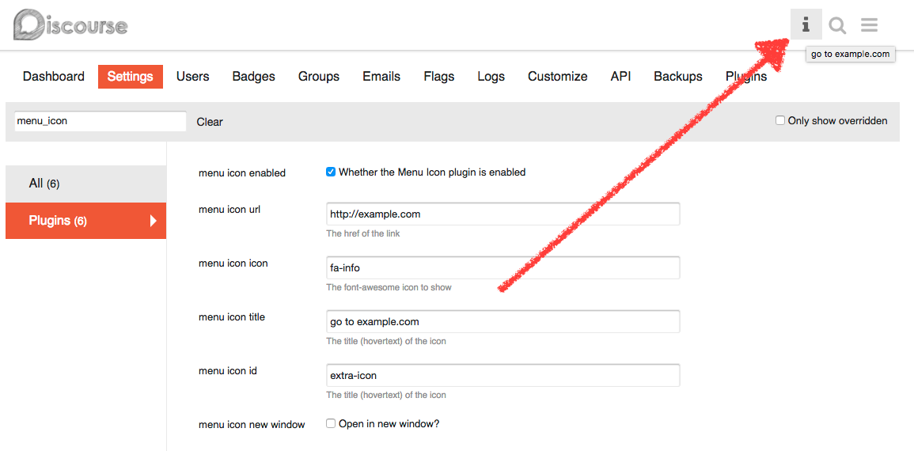

## discourse-menu-icon

This plugin allows users to add a single Font Awesome icon with link to the top-right menu

## Installation

Proceed with a normal [installation of a plugin](https://meta.discourse.org/t/install-a-plugin/19157).

## After Installation

The plugin is enabled by default and will link to example.com

## Known issues
[Two attributes don't work](https://meta.discourse.org/t/widget-helper-stripping-attributes/68014):
 - aria-label
 - _target

## About

### License

MIT
